原文：[WINNAS轻松搭：SillyTavern（酒馆）从入门到精通](https://www.rainlain.com/index.php/2024/11/19/2645/)

内容
：
WINNAS轻松搭：SillyTavern（酒馆）从入门到精通
2024年11月19日
本教程为系列教程，旨在使用Windows系统搭建完善的NAS各项服务。应该是全网WINNAS系统性、完整性最强的教程。

—— 系列教程 ——

相关文章（点击跳转）
1、硬件、系统+影视流媒体服务
从零开始搭建自己的流媒体服务器
EMBY媒体资源库进阶刮削方案
EMBY特殊影视资源刮削方案

2、音频流媒体服务（HIFI方向）
自建高音质流媒体服务器

3、漫画/小说平面媒体
自建在线漫画/小说库

4、DOCKER应用布置
各类AI大模型统一接口管理系统

5、酒馆系列
酒馆PC/NAS布置：点我
酒馆手机布置：点我
酒馆VPS服务器布置：点我
酒馆使用技巧合集：点我

喂饭：这里

—— 本文目录 ——

目录（CTRL+F快捷搜索）
一、SillyTavern简介

二、酒馆安装
1、安装NodeJS
2、安装Git for Windows
3、安装酒馆
4、运行酒馆
5、酒馆设置
6、酒馆更新

三、功能设置
1、首次登录
2、多用户管理
3、主题设置

四、申请Gemini API
1、注册账号
2、开通google api
3、新建项目
4、设置api
5、API报错

五、酒馆基础设置
1、预设
2、人物卡
3、世界书-人物书
4、世界书-世界书
5、正则
6、AI回复格式化
7、COT（思维链）
8、快速回复（Quick Reply/QR）
9、添加聊天背景

六、文字转语音
1、本地TTS
2、在线TTS

七、社区和其他
1、社区
2、人物卡
3、预设更新

一、SillyTavern简介

SillyTavern也称作酒馆。是由Cohee、RossAscends和SillyTavern社区共同推出，允许用户与文本生成 AI（LLMs）进行互动，以聊天和角色扮演自定义角色。酒馆能够尽可能理解“预设角色”的性格、背景，并以符合世界运作的逻辑进行扮演，我们过去可能见过的“AI猫娘”就是使用类似技术实现的。请不要以当前的通用型AI来判断酒馆的扮演的真实性和可玩性，亲身尝试，你一定会大吃一惊！

感谢测试服的小伙伴提供的测试图

为了方面各位朋友使用，BLOG主整合了本次教程所需的所有文件，可以点这里下载（rain）。但是为了避免出现各种奇怪的问题，建议还是自备梯子。本教程力求做到从安装到维护，从使用到进阶的全覆盖（长期更新）。相对比其他通用的酒馆教程，内容应该更全面也更深入。另外，酒馆作为一个使用大量AI服务的平台，除了使用AI生成文字，还可以接入TTS生成语音，接入NAI3或者stable Diffusion生成图片，还能通过插件实现各种动态效果。这些内容非常复杂，且相互交叉。因此本教程仅聚焦酒馆本身，其他AI相关内容请搜索本BLOG的其他教程。

二、安装

酒馆当前允许单机或者联网使用，基于其安全性考虑，所有登录酒馆的用户都必须使用密码和账号。因此除非二次开发，否则是不能当做公众服务使用的。当然作为WINNAS的一环，这个东西自己布置偷着乐就好，毕竟基于酒馆当前的性质，也不太适合作为公众服务使用（FBI OPEN THE DOOR）。

1、安装NodeJS：当前WIN上的酒馆基于NodeJS环境，打开网址并选择LTS（长期维护）版本下载，随后一路点击下一部安装即可。

2、安装Git for Windows：这是一个轻量的、本地化的git命令工具，可以帮助我们快速布置酒馆，其作用跟docker差不多，起到一个管理、拉取、更新的作用。跟nodejs一样，下载后一路安装即可。安装的时候会有很多个选项，全部不用管，一路next到底即可。

3、安装酒馆：在非系统监视文件夹地址内，创建一个文件夹（英文）。简单来说，如果你不懂哪些文件夹被系统监视，避开C盘即可。在该文件夹内打开命令提示符，点击顶部的“地址栏”，输入 cmd，然后按 Enter。

最后在命令提示符界面输入以下文字并回车：

git clone https://github.com/SillyTavern/SillyTavern -b release

希望深入学习、使用酒馆的朋友可以使用以下命令，安装测试版本的酒馆，将会第一时间使用到新的特性，但也会因此面临更多的BUG和风险。

git clone https://github.com/SillyTavern/SillyTavern -b staging

4、运行酒馆：随着安装完成，我们会发现选定目录下会生成一个“SillyTavern”文件夹，这就是酒馆本体了。进入文件夹，找到“Start.bat”，双击运行即可完成安装。这一步可能对梯子要求很高，如果失败可以尝试“全局模式”。

5、酒馆设置：我们还需要对酒馆进行进一步的设置，找到“config.yaml”文件，用文本打开。接着可以参照以下项目进行修改：

//这是映射的端口，如果打算外网使用，或者跟其他服务有冲突，建议修改。
port: 8000
//这是白名单模式，当前酒馆必须打开白名单或者身份验证模式任意一个才能正常启动，外网使用建议开白名单模式。
whitelistMode: ture
//身份验证模式，同上所属，两个必须任意开一个。不能两个都“ture”或者两个都“false”。如果使用该模式，记住修改后面的“username”和“password”。
basicAuthMode: false
//用户账号，打开这个选项将允许使用设置多个账号登录酒馆，外网使用时必须打开该功能。
enableUserAccounts: true
//打开这个将允许在登录页面隐藏用户列表，这将更进一步保护服务器安全和隐私，外网使用时必须打开该功能。
enableDiscreetLogin: ture
6、酒馆更新：

自动更新：Windows只需要使用“UpdateAndStart.bat”进行更新即可。
手动更新：可以到SillyTavern项目中，下载最新版本的ZIP包。然后将自己的“data”文件夹（用户信息）和“config.yaml”（系统设置）文件复制到新版本覆盖即可完成更新。

PS：如果使用git安装失败本体失败，也可以直接在github中下载最新版本的酒馆，然后直接运行Start.bat安装也行。但是采用这种安装方式，未来只支持手动更新。

三、功能设置

1、首次登录：在双击“Start.bat”成功启动酒馆后，我们即可设置自己的的用户名称。这个名称将会显示在所有的对话中，命名“自己”这个角色。

2、多用户管理：如图依次点击，进入管理员面板，即可新建用户。这里强烈建议关闭默认的“User”用户，该用户是系统默认用户，在“basicAuthMode”模式下会作为默认用户使用，因此不能删除。为了避免风险，建议点击禁用按钮，关闭该用户。另外也别忘了在禁用前新建一个自己的管理员账号。
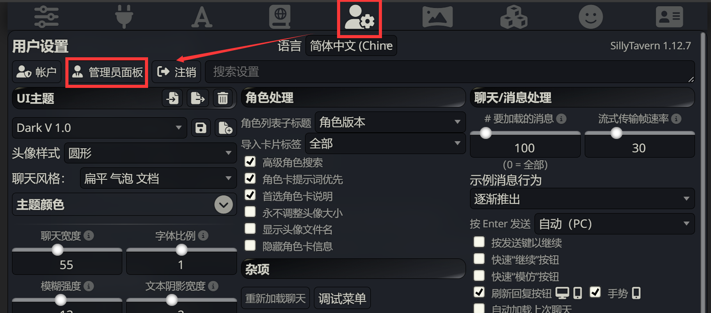
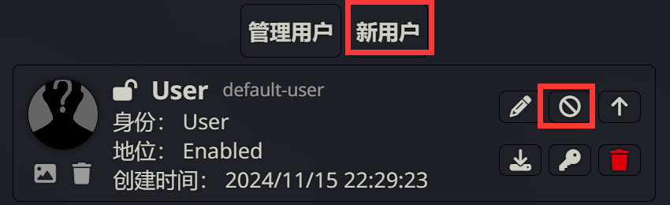

3、主题设置：如图，同样在用户页面，点击“UI主题”右面的导入按钮，将下载好的主题文件“XXX.json”文件导入酒馆。随后点击下面的菜单，选择刚刚导入的主题，即可达成一键美化效果。部分主题可能需要更复杂的设置，请各位自行发掘了。PS，这也页面右面有个“禁止外部媒体”的勾可以去掉，部分人物卡会载入外部的多媒体内容，禁用就无法播放了。
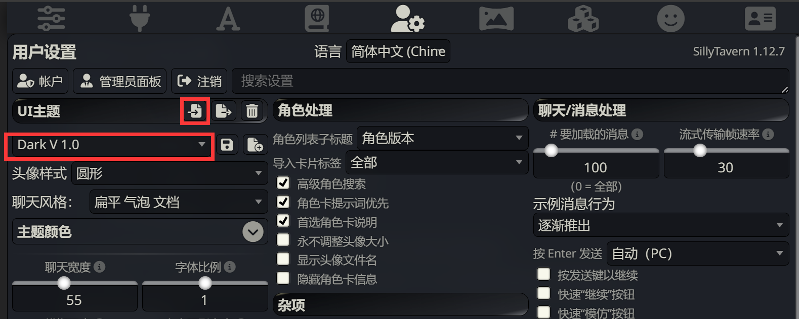
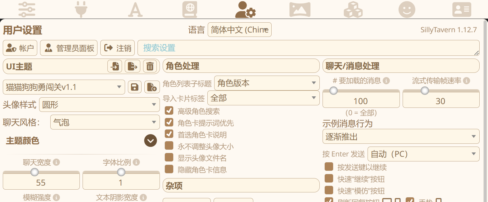

四、申请Gemini API

酒馆本身只是一个平台，自己并不具备AI思考运算的能力。我们需要为酒馆接入一个合适的AI，才能让酒馆运作起来。当前免费且效果好的AI我们首选的就是Google Gemini。另外即使算上付费，Gemini仍然是比较便宜的，当前大约80RMB可以购买到1000万token。

1、注册账号：首先去google官网一个google的账号。当前账号申请需要使用手机验证码。这一步当前仅需梯子即可完成，进入GOOGLE主页，然后根据提示操作即可。

2、开通google api：随后，我们打开Google AI Studio，初次登录根据提示点击Continue即可。
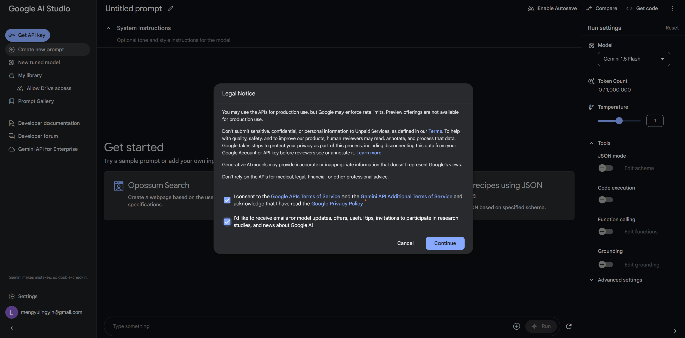

随后我们点击左上角的“Get API key”，然后在弹出菜单中继续选择“Create API key”。如果你这里显示的是中文，就点击“创建API密钥”。随后在弹出的页面中选择“Gemini API”项目，最后点击确定即可创建你的第一个Gemini api。
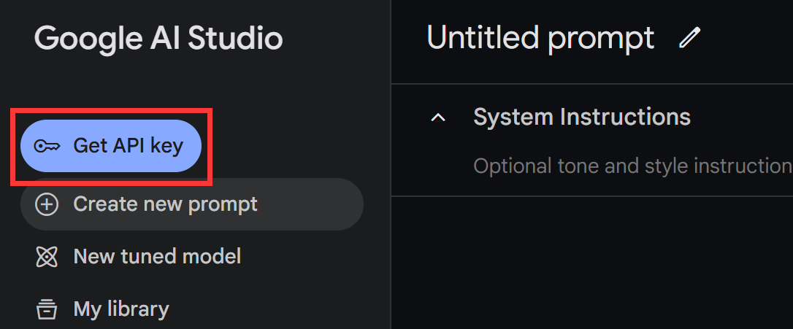
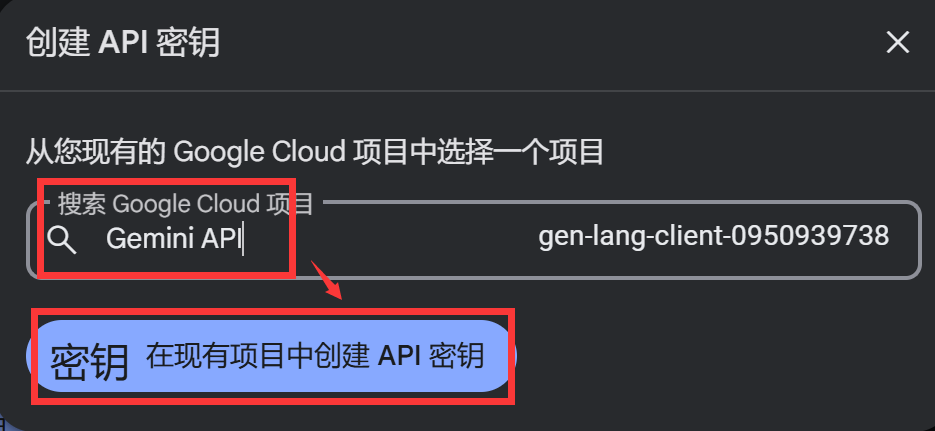

3、新建项目：需要注意的是，当前Gemini的api虽然能提供用户免费使用，但是同一个项目下的不管多少个api都受到统一的配额限制。具体来说就是每天50次gemini-pro和1500次gemini-flash的响应。理论说，如果在酒馆中使用gemini-flash，那一天1500条肯定是足够了，但是如果使用生成质量更好的pro，那么50条就会非常捉襟见肘。这时候我们可以到Google Cloud新建多个不同的项目，随后回到上一部在不同的项目上申请api，即可增加实际可用的api数量。
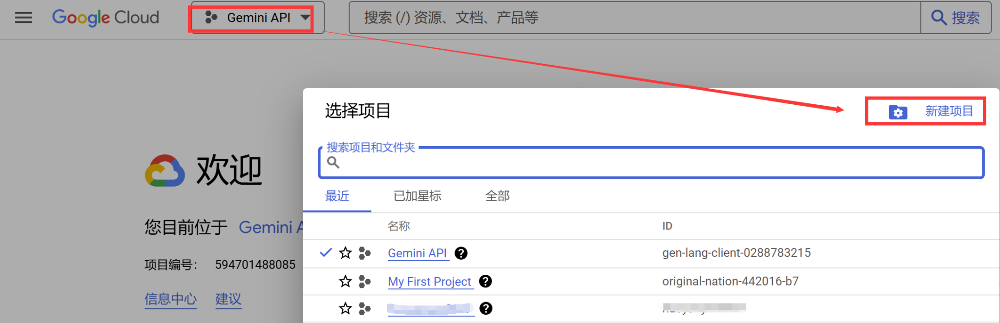

4、设置api：申请api后我们回到酒馆，根据下图设置，将刚刚申请的api密钥填入，并选择好需要使用的模型。（当前Gemini输出质量最好的模型是pro-exp-1114，但是常规设置并不能使用，有两个方法可以解决这个问题。最普通的方法是用文本打开一下路径的文件：

\SillyTavern-release\public\index.html
随后搜索optgroup label="Subversions"，然后将：

<option value="gemini-2.0-flash-exp">Gemini 2.0 Flash Experiment</option>
添加到该栏目下即可实现对API的调用。其中“gemini-2.0-flash-exp”是模型名称，可以在gemini官方文档中确认，后面的“Gemini 2.0 Flash Experiment”是在酒馆中显示的名称，可以自定义。
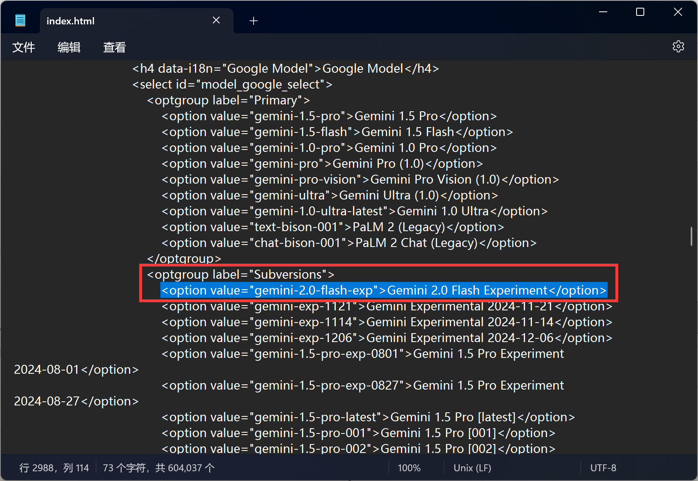

第二个方法可以参考这篇教程进行设置，以上设置全部完成过后，点击酒馆api页面的“连接”按钮，如果系统提示成功，那酒馆就正式营业了！
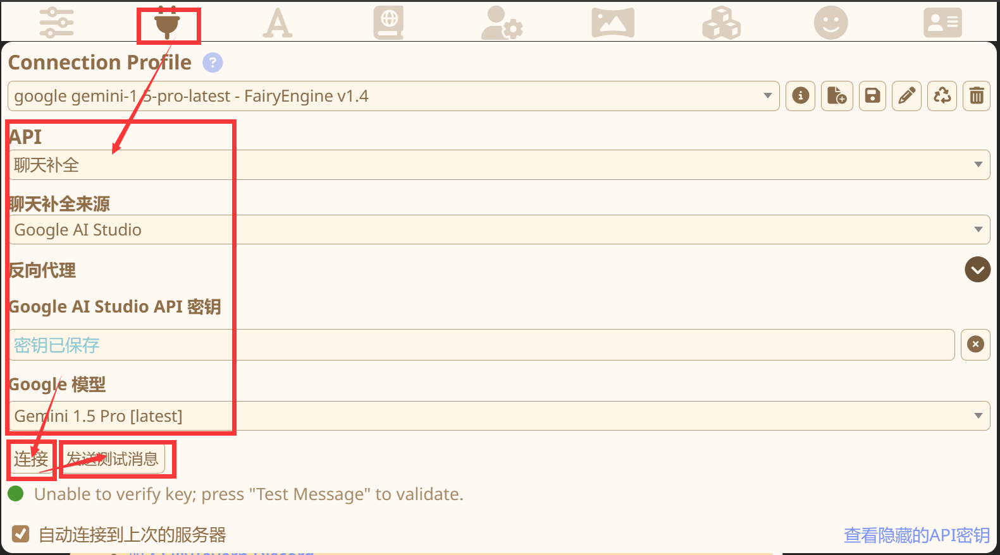

5、API报错

如果在使用过程中遇到上图这样的错误，基本上可以认为是梯子出了问题，注意并非可以访问gemini的网站就代表梯子正常。对于PC用户而言，需要打开CLASH中的“TUN模式”才可以正常链接API使用。如果是用路由器梯子的，则没有这个问题。如果不确信是哪个环节出现问题，可以考虑注册一个deepseek使用，如果deepseek正常而Gemini不行，则基本上100%可以确认是梯子问题。
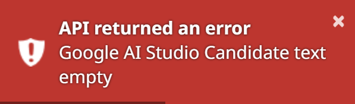

如果在使用过程中遇到上图这样的报错，基本上可以认为是预设出现问题，多数情况下是“破限”带来的。最好的处理方法是到社区里面找最新的破限，并仔细阅读使用说明，避免出现问题。由于该问题是用户与AI之间长期博弈的结果，因此没有统一的解决方案，请多关注酒馆社区的进化。

五、酒馆基础设置

1、预设：预设是控制AI输出逻辑、限制的核心，我们必须使用核心来控制AI输出的边界和功能。如图所示，首先我们确认最上方是选择的是“对话补全预设”，如果这里显示的不是对话补全，需要到API接入那里进行设置。随后需要在“对话补全预设”右面第一个按钮导入一个下载好的预设。使用Gemini API的人需要注意，下方的“流式传输”必须取消勾选，否则可能会出现输出截止（就是输出一半突然停了）的问题。
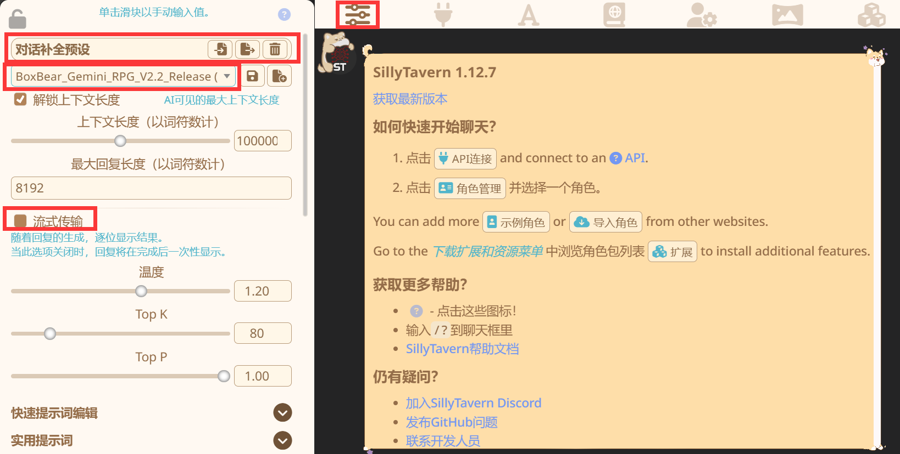

我们继续拉下去，就会看到当前预设的使用说明（不一定都有），建议使用预设前都看看这个预设的说明和开启的项目。如下图红框所示，预设的每一个功能都单独设置了开关，参考说明之后，可以对不同功能进行打开和关闭。这些细节的调整，很可能会影响到全局的输出质量。
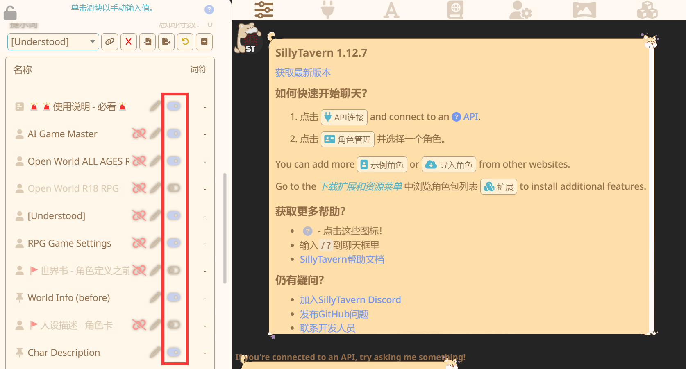

2、人物卡：顾名思义，就是可供聊天的主体对象。通常是1人，当然根据卡面设计，也可以是多人。人物卡通常包括该人物的个性、经历、人际关系、对待事物的态度、口癖、外观等关键描述。是构成该人物的核心因素。我们通常可以在选中人物卡后，看到作者撰写的“角色描述”，这会让你更快速地了解这位角色以及这张卡的大致内容。
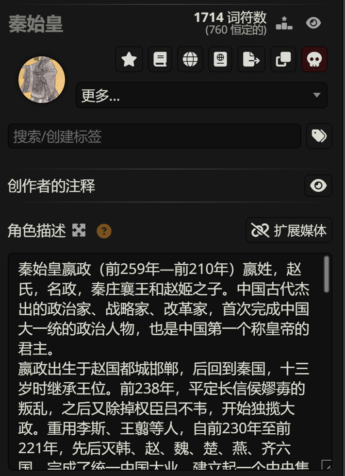

导入人物卡也非常简单，参考下图依次点击即可导入下载好的人物卡。人物卡一般格式为PNG格式（也就是图片），他通常同时也是一张可以看到角色形象的图片。
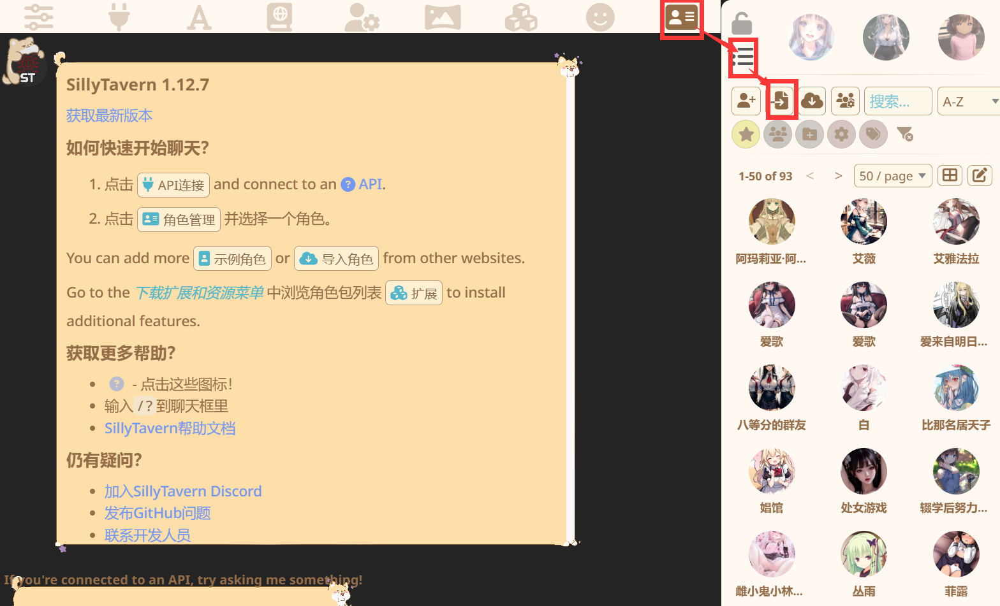

部分人物卡导入之后，初次打开会弹出下面这个对话框，这是提示该人物卡绑定了一个属于他的“世界书”，一般我们点击“是”，用于导入该世界书。世界书的具体介绍请继续往下看。
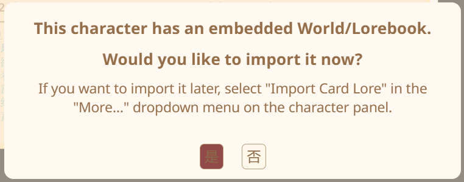

人物卡导入后，我们可以观察人物卡最下面的“第一条消息”栏，该栏目的文字语言，决定了这张卡的默认输出语言。如果导入之后发现人物卡是其他语种，可以通过翻译软件，将这段话翻译后，即可改成中文卡游玩。但需要注意，这只是权宜之计，最佳方案是在中文社区，找专门以中文开发的卡片，以避免AI在输出过程中突然给你飚两句外语。
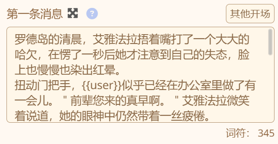

3、世界书-人物书：世界书的一种，人物书一般绑定在人物卡上，就是前面所述的初次载入人物卡时会提醒加载的内容。人物书专门用以扩展该人物的描写内容。通常包括与“人物卡”有关的人物关系、地名、世界观等内容的具体描述。帮助AI更好地识别所处环境，并更好地玩家产生互动。这也将有助于AI拓展自己的认知边界，不会出现太多超游或者不符合逻辑的扮演。
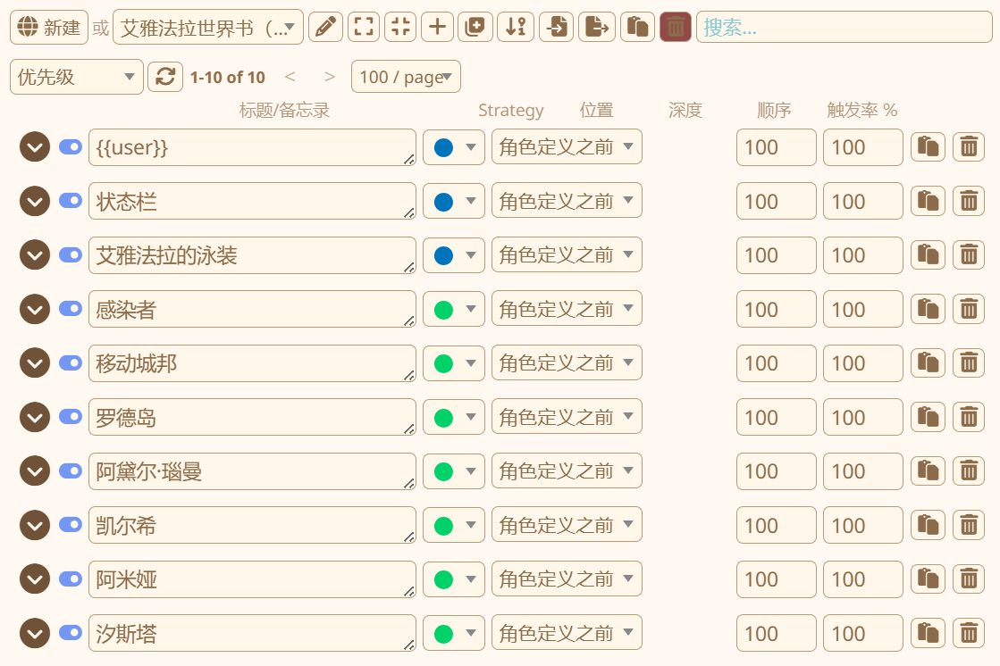

另外，如果需要对其进行修改，可以点击下图红框所示。通常是卡片作者已经写好的内容（部分卡片也可能没有人物书）。
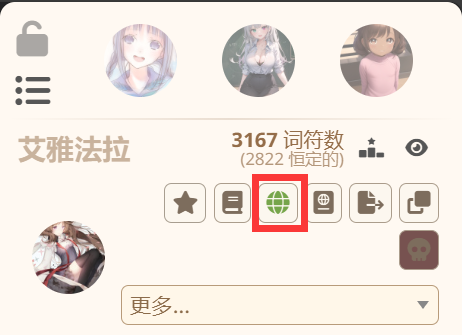

4、世界书-世界书：世界书的本体，与人物书一样，提供更详细的描述扩写，用以规范AI的创作边界。世界书一般脱离人物，主要描述整个世界范围的内容。比如国家、地区、文化、主要组织、历史等。AI可能不能马上使用这部分内容，但是对于营造故事的氛围感和未来可能存在的剧情关联，有至关重要的作用。需要注意的是，人物书只能绑定到人物卡上，最多1个，而世界书则可以同时启动多个。如下图，我们可以按照顺序点击，即可导入已经下载好的世界书。
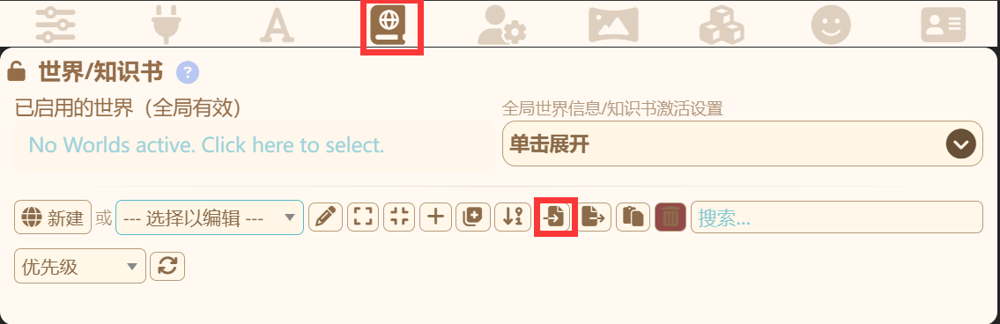

导入世界书完毕后，我们可以在下图的位置设定默认打开的世界书（允许多个）。酒馆AI输出的过程中，按照“API、预设、人物卡、人物书、世界书”的顺序，默认左高右低的优先级进行思考输出。
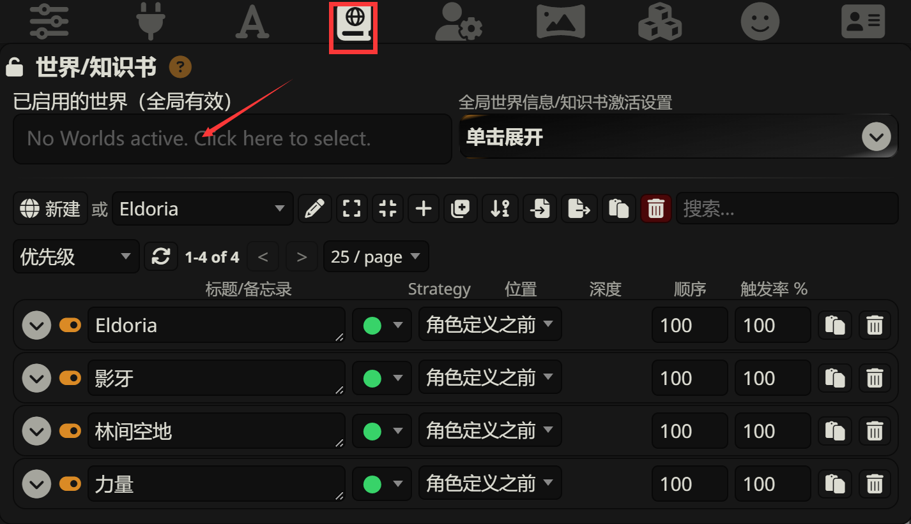

5、正则：酒馆的正则主要是对最终输入AI的文本做进一步的优化或功能叠加。不同的正则提供的效果完全不一样。可能是对某些特殊玩法开发的面板，也可能是对某个预设进行字数优化。正则的导入非常简单，如下图所示导入json文件即可。正则可以有全局正则和局部正则，一般根据正则的具体效果，选择导入即可。
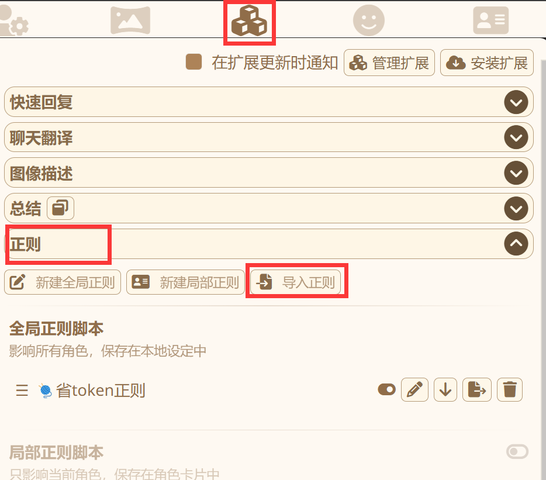

6、AI回复格式化

这是进一步通过规范格式对酒馆输出内容进行规范化的设置。其中需要关注的是“系统提示词”中的几个具体选项。这些选项的优先级不如人物卡中相关的描述要求，如果人物卡已经有相关的对AI回复的描述，这些设置可能不生效。但是对大部分卡而言，这部分内容都将很好地规范输出的内容。

Actor：AI将扮演一个专业的演员，不会被指认或自认为是AI。
Neurtal-chat：允许玩家与AI进行聊天（也就是AI同时扮演玩家）
Roleplay-Detailed：缓慢发展故事，更丰富的描写，不会出现跳跃性的发展。
Roleplay-Immersive：仅做一个回复，不扮演玩家
Text Adventure：适合跑团（DND&COC）
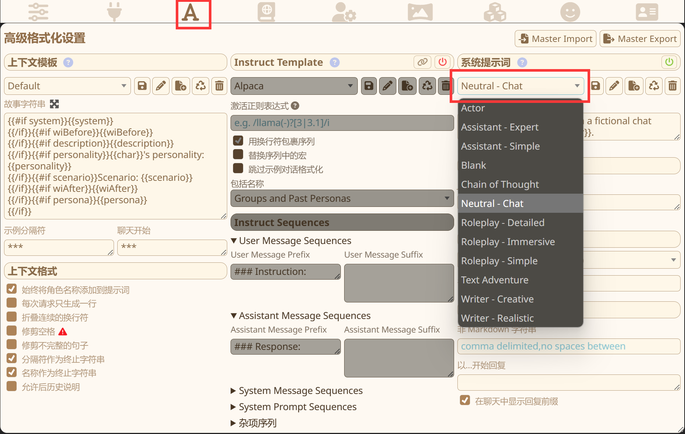

7、COT（思维链）：酒馆允许自设一定的思维链路，比如下图红框部分，就是聊天中的COT状态栏。这个状态栏是通过世界书撰写的COT思维链。设计思路就是为角色添加一个累计的数值，比如“好感度”。每次对话通过分析内容对好感度进行加减操作。然后累计的好感度将会出发下一层级的关系：陌路——好友——爱慕。然后不同的关系则会触发不同类型的行为。整个过程的控制，我们称之为思维链。
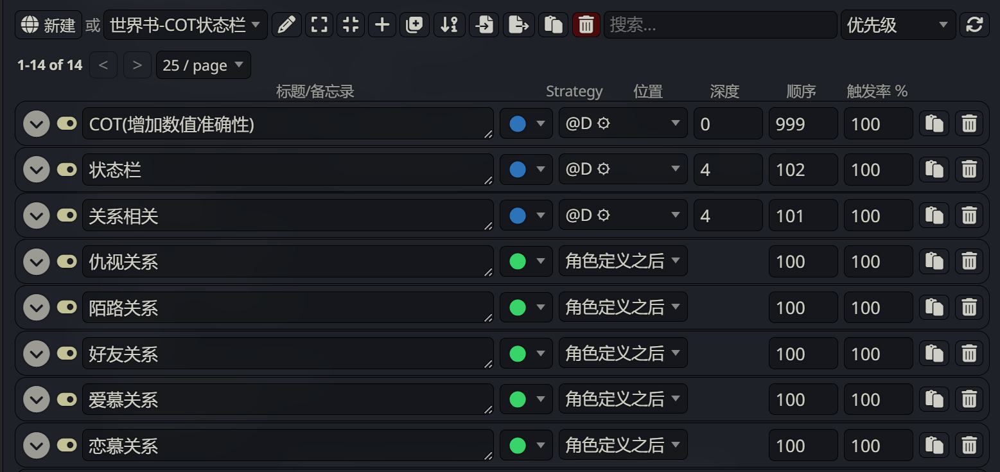

8、快速回复（Quick Reply/QR）

当你懒得打字或者面对一些剧情不知道该如何发展，又或者希望玩些新花样的时候，预设好的QR功能将很好地辅助你在逻辑畅通的前提下，继续推进故事。我们点击酒馆上方插件栏目，随后打开快速回复选项。勾选“启动快速回复”以打开这个功能。接着如图点击下方的按钮，导入已经下好的快速回复“xxx.json”文件。（注意，酒馆大部分导入脚本都是.json文件，但是他们的功能可以是预设、正则、快速回复，别导入错位置了）
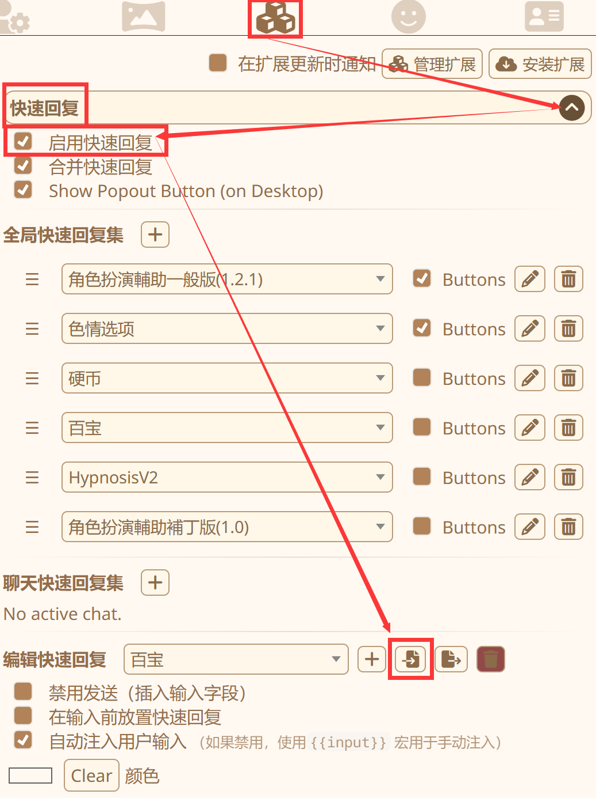

完成导入后，我们可以看到上面有两个回复集，分别是“全局快速回复集”（对所有卡生效）和“聊天快速回复集”（仅对当前卡生效），根据需求自己设定就可以了。另外部分的QR有配套的世界书/正则需要同时导入并启动，可以根据前面教程一起导入使用即可。

9、添加聊天背景

酒馆的聊天背景上传也非常简单，直接按照下图依次点击，即可完成图片上传。
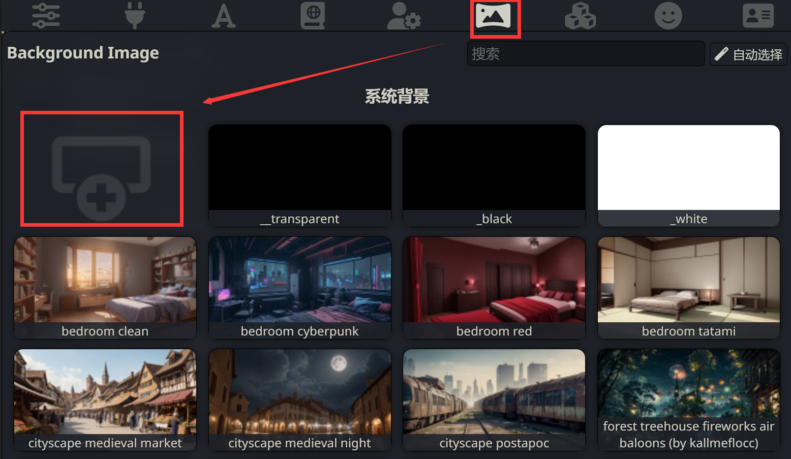

但是对于需要快速管理背景的人来说，直接打开以下地址，可能是更快捷的管理方式

\SillyTavern-release\data\user\backgrounds
六、文字转语音（让酒馆开口说话）

1、本地TTS（Microsoft/无需显卡支持）

酒馆默认提供了极其丰富的API接口，但是就如同前文所说，酒馆本身不提供AI服务，因此这些接口都需要单独照对应的AI服务接入才能使用。本教程主要着眼于“免费”，所以这里推荐使用WINDOWS自带的TTS引擎。如下图所示，打开插件菜单，选择TTS栏目。然后选择TTS来源中选择“System”，勾上下面的“Enabled”以确定启动该服务。随后在下方指定各个登场角色所使用的语音：“Dafaule Voice”（旁白）、“User/玲雨”（这里是主角，名字是BLOG主自己起的）、“艾雅法拉”（人物卡或者出场人物的名字）。最下方的“Acailable voices”可以预览该模型提供的所有语音种类。另外需要注意，TTS一般是需要对应语种的。比如中文就必须选择中文的语音模型，如果使用别的语种应该会报错。
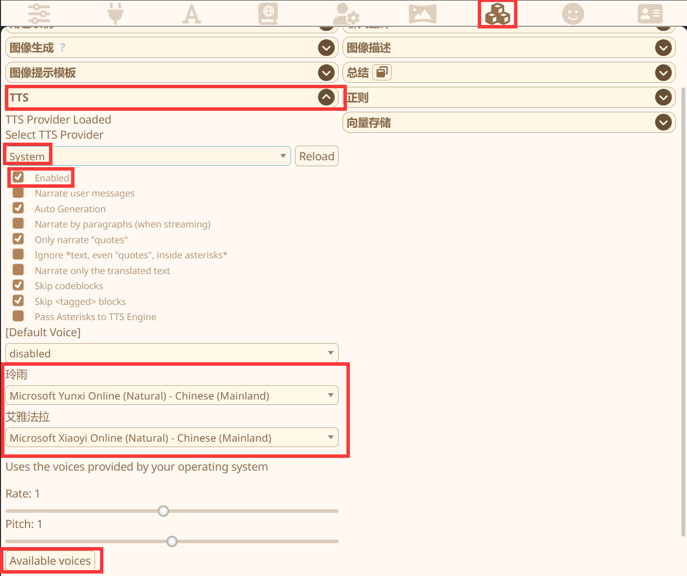

2、在线TTS（EDGE/免费）

我们也可以使用借用EDGE浏览器的在线TTS服务语音，他同样是调用微软的TTS服务，只不过音色选择更丰富（其实没卵用），使用方法也非常简单，可以参考这个项目。稳定性其实不如上面的本地TTS。

1、首先修改config.yaml设置文件中的enableServerPlugins为true
2、来到SillyTavern的根目录，按照上文方式打开CMD，随后输入如下代码运行

cd plugins
git clone https://github.com/SillyTavern/SillyTavern-EdgeTTS-Plugin
3、最后重启整个酒馆服务器，到TTS中选择EDGE就可以使用了。至于每个选项所代表的意思，可以自己翻译一下网页，非常好理解，这里就不在多做赘述。如果遇到语音输出出现问题，那么问题多半是在其他的环节上。
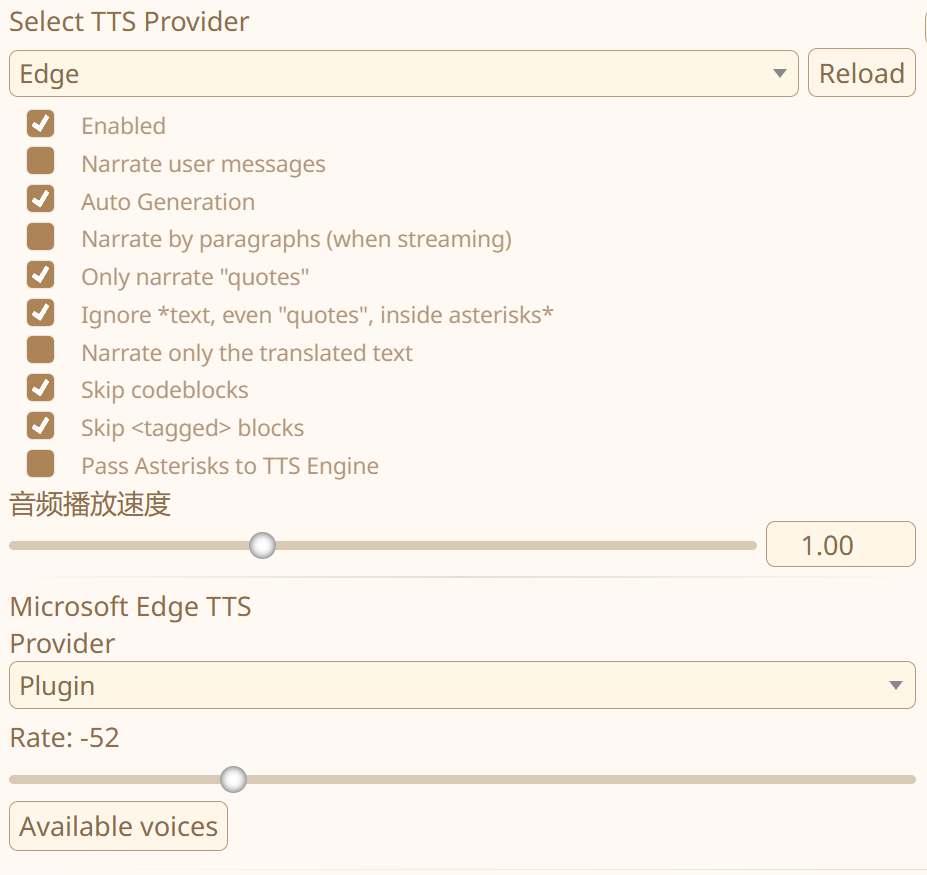

七、社区和其他

1、社区：很多朋友要问了，如何获取更多的人物卡、预设呢？BLOG主整理了一些酒馆的社区和资源站点，供各位使用。
SillyTavern（Discord）：酒馆官方频道，全英文社区，跟中文社区的氛围和内容有很大的区别，英语好且有兴趣了解国外酒馆发展的朋友可以留意。
类脑（Discord）：酒馆最大的中文社区，资源包括预设、插件、人物卡等所有与类脑相关的内容。新人必须仔细阅读新人必看文档，遵守社区公约。
旅程（Discord）：类脑的分部，继承了类脑绝大多数板块，分类更清晰、更简洁。由于类脑的部分板块已经关闭，因此旅程很快会逐步取代类脑的地位，成为最大的酒馆中文社区（可能）。
自由AI阵线（Discord）：专注于本地化模型的社区，有许多微调的模型发布，对自己的GPU有信心的，不想用在线API的，可以关注。
拟人（Discord）：一个独立新生社区，对新人很友好，内容也非常丰富，讲道理现在酒馆社区好像变多了，可能这就是AI发展的必然趋势吧。

2、人物卡：单独的人物卡获取，无需混社区。但是大部分是英文卡，自己拿AI翻一下开头，就可以顺利输出中文了。
character-tavern（Web）：一个优秀的酒馆人物卡网站，无需注册，没有广告，UI优秀。
Chub AI（Web）：同样优秀的酒馆人物卡网站，标签清晰，无需注册，没有广告。

3、预设更新：以防止有人无法进入社区获取预设，这里提供一些长期更新的预设站点。
ny预设：claude和gemini的专用破限，效果不错，破限强大。

